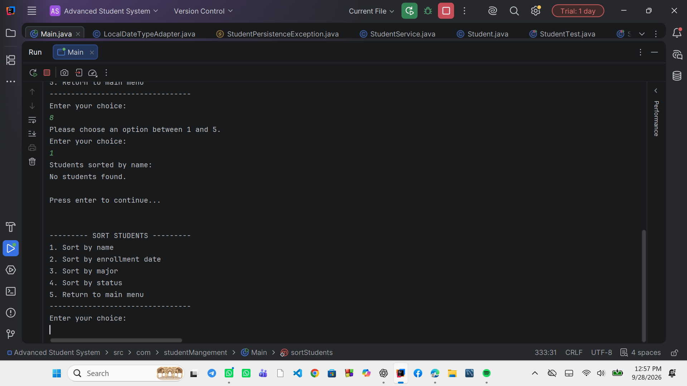
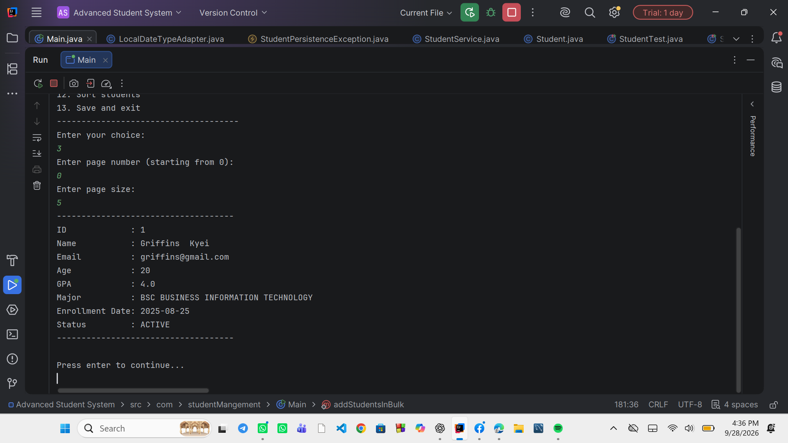
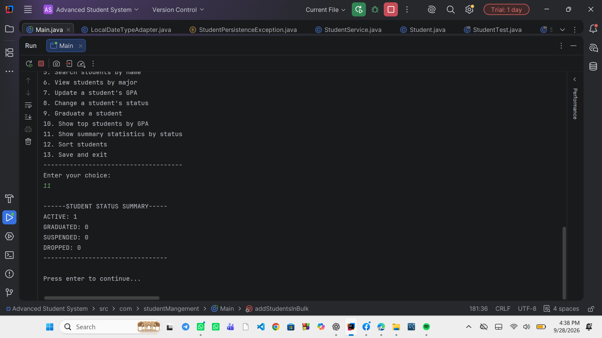
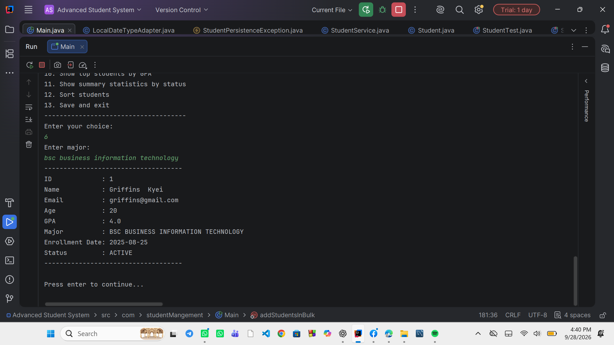
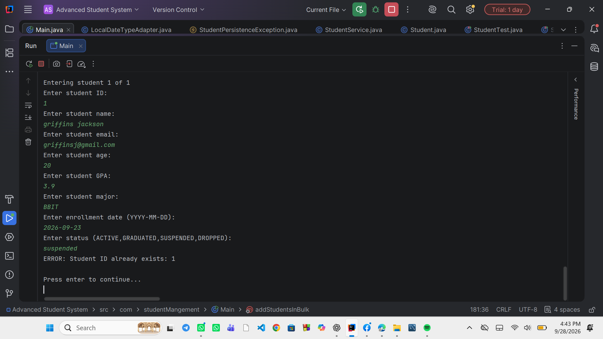
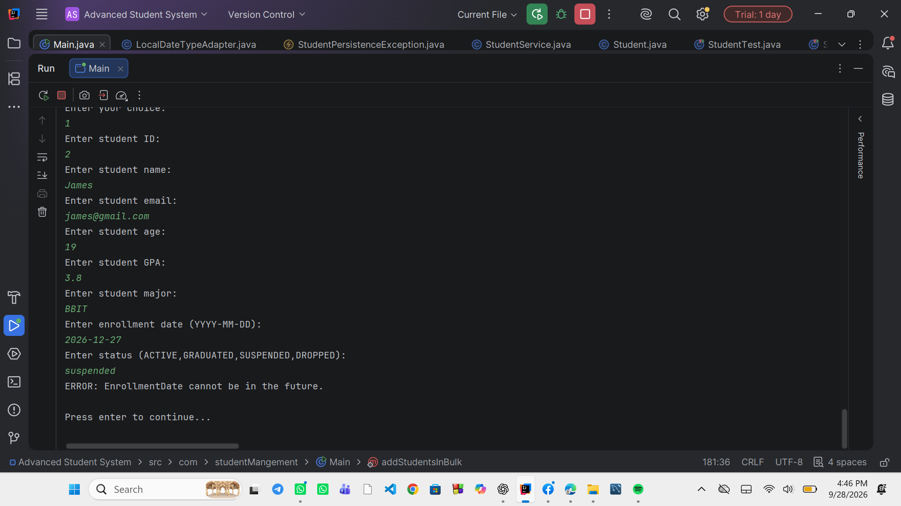
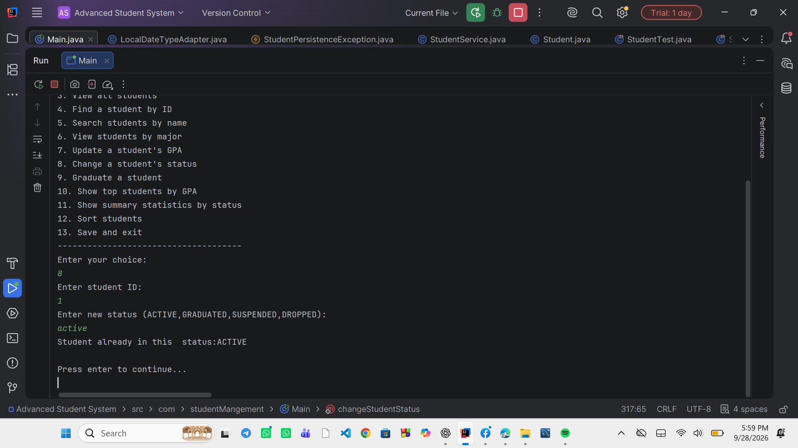

# Advanced Student Management System

## 1. Project Purpose and Features

The Advanced Student Management System is a console-based Java application
for managing student records. It demonstrates object-oriented programming,
layered architecture, validation, exception handling, collections, streams,
sorting, JSON persistence, and unit testing.

### Main Features

- Add a single student
- Add multiple students in bulk
- View students with pagination
- Find a student by ID
- Search students by name
- View students by major
- Update a student's GPA
- Change a student's status
- Graduate a student
- Show the top 10 students by GPA
- Show summary statistics by status
- Sort students by name, enrollment date, major, or status
- Save and load student data using JSON
- Handle invalid input without crashing

---

## 2. Java and Gson Versions

- Java: 17+
- Gson: 2.10.1

The application uses standard Java libraries together with Gson for
JSON serialization and deserialization.

---

## 3. How to Compile, Run, and Test

### Compile

Compile the project using Java 17 or later with Gson 2.10.1 included
on the classpath.

### Run

Run the `Main` class:

`com.studentMangement.Main`

The application starts with the main menu and continues running until
the user selects **Save and Exit**.

### Test

The project uses JUnit 5 for unit testing.

Tests cover important functionality including:

- Student validation
- Repository operations
- Student service operations
- Duplicate IDs and emails
- Status transitions
- JSON save and load behavior

---

## 4. Architecture and Package Explanation

The application follows a layered architecture:

**Entity → Repository → Service → Console/UI**

### Entity Layer

Package: `com.studentMangement.entity`

Contains the main domain objects:

- `Student`
- `StudentStatus`

The `Student` class also protects its own data through validation.

### Repository Layer

Package: `com.studentMangement.repository`

Responsible for storing and retrieving students.

Main components:

- `Repository`
- `InMemoryStudentRepository`
- `JsonStudentRepository`

`InMemoryStudentRepository` stores students using a `HashMap`.

`JsonStudentRepository` provides persistent storage using `students.json`.

### Service Layer

Package: `com.studentMangement.service`

`StudentService` contains the main business logic, including:

- Student registration
- Duplicate checking
- GPA updates
- Status changes
- Searching and filtering
- Pagination
- Top students
- Status summaries
- Sorting

### Exception Layer

Package: `com.studentMangement.exception`

Contains custom exceptions such as:

- `InvalidStudentException`
- `StudentNotFoundException`
- `DuplicateStudentIdException`
- `DuplicateEmailException`
- `InvalidStatusTransitionException`
- `StudentPersistenceException`

### Utility Layer

Package: `com.studentMangement.util`

Contains reusable utilities including:

- `ConsoleUtils`
- `LocalDateTypeAdapter`
- `StudentComparators`

`ConsoleUtils` handles common console input and output operations.

`LocalDateTypeAdapter` allows Gson to handle `LocalDate`.

`StudentComparators` contains reusable comparators for sorting students.

### Main / Console Layer

`Main` acts as the composition root. It creates the repository,
service, and console utility objects and starts the application.

Application-specific menus are kept in `Main`, while `ConsoleUtils`
contains reusable console utilities.

---

## 5. JSON File Location and Behavior

Student records are stored in:

`students.json`

The JSON repository:

- Loads existing students when the application starts.
- Automatically saves changes to the JSON file.
- Uses Gson for serialization and deserialization.
- Uses UTF-8 encoding.
- Uses pretty-printed JSON.
- Uses a `LocalDate` adapter for enrollment dates.
- Handles malformed JSON using `StudentPersistenceException`.
- Uses temporary-file replacement when writing the JSON file.

Because changes are automatically persisted, **Save and Exit** confirms
persistence and then closes the application.

---

## 6. Validation and Status-Transition Rules

### Student Validation

The application enforces the following rules:

- ID must be positive.
- ID must be unique.
- Name must contain 2–100 characters.
- Email must have a valid format.
- Email must be unique, ignoring case.
- Age must be between 16 and 60.
- GPA must be between 0.0 and 4.0.
- Major must contain 2–100 characters.
- Enrollment date cannot be in the future.
- Student status cannot be null.

### Student Statuses

The available statuses are:

- `ACTIVE`
- `GRADUATED`
- `SUSPENDED`
- `DROPPED`

### Allowed Status Transitions

- `ACTIVE → GRADUATED`
- `ACTIVE → SUSPENDED`
- `ACTIVE → DROPPED`
- `SUSPENDED → ACTIVE`
- `SUSPENDED → DROPPED`

`GRADUATED` and `DROPPED` are terminal statuses.

Changing a student to their current status is treated as a no-op because
there is no actual state change required.

---

## 7. Example Console Workflow

A typical workflow is:

1. Start the application.
2. Select **Add a single student**.
3. Enter the student's details.
4. The application validates the information.
5. Select **View all students** to display records.
6. Select **Update a student's GPA** when necessary.
7. Select **Change a student's status** for a valid status transition.
8. Select **Sort students** to sort by name, enrollment date, major, or
   status.
9. Select **Show summary statistics by status** to view status counts.
10. Select **Save and Exit** to finish the application.

---

## 8. Non-Obvious Design Decisions

### Validation in the Student Entity

Student validation is kept inside the `Student` class rather than creating
a separate validator class. This helps ensure that a `Student` object
cannot easily be created with invalid field values.

### Business Logic in StudentService

Business rules such as duplicate detection and status transitions are
handled by `StudentService` rather than by the console interface.

### Menus in Main

Application-specific menus are kept in `Main`. `ConsoleUtils` contains
generic console utilities so that it can be reused by other console
applications.

### Comparable and Comparator

`Student` implements `Comparable<Student>` for its natural ordering:

1. GPA descending
2. Name ascending
3. ID ascending

Separate reusable `Comparator<Student>` definitions are used for the
additional sorting options.

### Automatic JSON Persistence

`JsonStudentRepository` automatically saves changes. This keeps persistence
responsibility inside the repository instead of requiring the UI to
manually save after every operation.

### Bulk Registration

Bulk registration validates the complete collection before saving it.
This prevents duplicate IDs or emails within the same batch and checks
for conflicts with existing students.

---

## 9. Final Design Summary

The application separates responsibilities between the entity, repository,
service, utility, and console layers.

The entity protects student data, the repository handles storage, the
service handles business rules, and `Main` controls the application flow.

The system uses Java 17+, Gson 2.10.1, JSON persistence, custom exceptions,
JUnit 5 tests, `Comparable`, reusable `Comparator` definitions, and
Java collections and streams to implement the required functionality.

---

### 10.  Screenshot Demonstration

